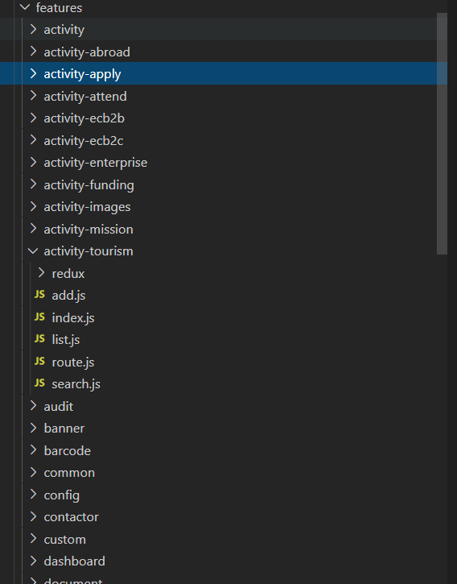
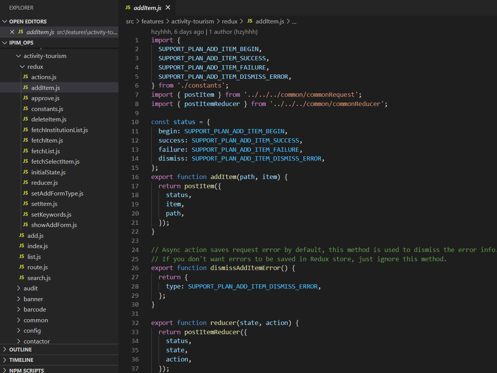

# 外包项目总结

    提示: 本文没有什么技术干货，只是个人的总结观点

文章开头，我先吐槽下这次开发经历，是真的糟糕透了。在经历了两个星期左右的外包项目开发，实际时间也没有具体算过，心中的感慨万千。

为什么说我不知道具体的开发时间呢？

因为我不是主要做外包的，也就是说我是在用业余时间做外包，接的外单开发。其实这不是我第一次做外单了，但就是因为这次让我很难受，我在下面做总结阐述吧。

 
 

## Why to do 外单

一是为了钱，二是为了磨炼自己。

之前做过的外单长达一个多月，所以觉得这次的外单应该也没问题，而且现在所在的公司是 965，可以接来做做看。于是乎，就从朋友那接了。做外单确实是很能磨炼人，在一天正常的上下班后，要用自己的业余时间来做外单开发，也就是说下班后吃个饭接着上班了，在高强度下压榨自己，体验下 007(应该是 927)的工作，趁着自己还是有点资本让自己耗的情况下多干点。

其实我所在的公司业务量也不少，在忙碌完公司的业务开发后，接着回家继续干是挺累的，但想着这来钱快，也是给自己心里一点小小的安慰。虽然自己身上没有房贷车贷，但为了未来，自己也是要不断拼。

接下来，说说这个外单的一个整体开发流程。

## 前期准备

在一开始说要接外单的时候，心里是有点害怕的，担心自己会做不好，担心自己没时间做不完，担心自己技术不过关等等，但过了一遍需求后，觉得还行，那就干。

首先由甲方给我们说明下整个项目的背景及业务流程，说了后，就是做时间评估及报价了，如何定时间评估及报价呢？

1. 项目评估

   观看整个项目，因为这个外单是一个二次开发的项目，已经确认了技术栈及架构。这也是我将这个项目开发时长估错的主要原因之一，技术选型和架构设计，确实是项目开发中的重点部分，少了这两个，应该是不用耗费太多时间的。

2. 人员确认

   这个项目中，我们投入的人力有三个，不是我一个人单干，这个外单涉及到的不单单只有前端，还需要后台写业务和接口。对于后台，我只是懂得一些基础的皮毛，没办法独立完成。

从以上两点是我个人的观点，在项目评估中，项目决定人员，人员决定时间，再根据人员及时间来做一个报价预估，将这个预估价格报给甲方，再由甲方决定最终报价。

其实正规点的流程会涉及到竞标等，但这取决于甲方的规模及决策了，这里我就不细说了。

在双方同意确认后，将由甲方书写协议合同，并需要双方签名(画押)。如果在不了解甲方，且不确定甲方是否有信用危机的情况下，签订协议也是相对重要的，它是我们劳动人民的保障凭据，为了防止某些恶意操作，白字黑字盖章挺重要；如果双方都可信任，这一点也不是那么重要了，走走流程而已。于是进入下一步，代码开发。

> Tip: 在这里提一点，在项目款中，会分批支付，有 3/7 分，3/5/2 分等，也就是说在项目开始时，你会先拿到一部分的首款，如果 3/7 分，只有在项目交付才拿到尾款，如果 3/5/2 分，在项目开发后期交付会给 5 成，并且维护这个项目一段时间后才能拿到剩余。这些甲方必须明确说明，并且支付首款，要不然后期容易扯皮，骚操作等。虽然我没遇到过，不过还是担心这个。

## 如何看待这个项目

项目管理是运用管理的知识、工具和技术于项目活动上，来达成解决项目的问题或达成项目的需求。

我是一个管理能力较欠缺的，但作为这个外包项目的对接人，要与甲方开发对接，必须十分了解这个外单的开发需求，协调我方的开发人员，做好开发计划，时间把控等。
该项目需要前端开发的有两部分：用户端与管理端；后端开发：提供两端接口。

### 技术栈

因为这个项目是二次开发，前端技术栈是同时用到了 `react` 和 `vue`，我也不清楚为什么对方会这么选择，难道还不是一个团队在开发？同一个项目上，最好技术栈能够协调好，要不然开发时会比较痛苦。用户端是 `vue+vuex`，管理端是 `react+redux`。

使用 redux 也是我觉得比较难受的一点，我个人觉得 redux 使用起来比较繁琐，定义 `action`，`reducer` 及 `store`，并且这个项目是 redux 的重度使用者，几乎每个页面都有用 redux 去管理它的状态及表单变量，所以几乎每个文件目录下，都会看到 redux 的定义文件，每次新增一个页面都需要将代码 repeat 一遍。

> 以上是我个人对 redux 的一些吐槽，可能是我还没有真正理解到它的魅力，等后续学习后看能否让我改变对它的观点。

### 分支管理

项目开发中，对于代码管理来说，分支管理也是相当的重要，如何做好分支管理？本人也是菜鸟一个，从这个项目中学习一下。

首先介绍下我使用的分支管理可视化软件：[Fork](https://git-fork.com/) ，它能很直观的展示项目的所有本地/远程分支，节点，tag 等，并且可以按分支做筛选显示，同时还集成了 git 的操作，个人觉得非常好用。

在这个项目里，由于是多个团队同时开发，难免的会有代码冲突什么的，这并不可怕，可怕的是，对方在处理冲突的时候，不提前 rebase 他人代码与 review 下，无脑的覆盖他人代码，这样做会导致他人开发过的业务逻辑可能会因为点点失误而导致整个流程失败，开发人员又要耗费时间去重现 bug 及修复。

> 吐槽下，这次项目中已经遇到过多次类似的代码被其他团队冲突处理时改动到，并导致我们需要消耗时间去修复 bug。

多团队分支管理，每个团队都有自己的开发分支，需要每次开发人员提交代码时，先将 dev 分支上的代码 rebase 到自己的分支，再将代码提交并将 dev 分支 rebase 到最新，这样其他团队在合并自己分支时，就需要先将 dev 分支 rebase 到自己分支，执行相同操作，这样就会尽量避免业务冲突。遇到冲突时，询问下代码冲突部分的开发人员详细逻辑处理，不要盲目提交，这样做也是为了不影响他人业务开发，减少 bug 及时间损耗。

> 以上是我个人在这次项目中学习到的一些分支管理，后期会继续学习加强。

 
 

## 开发中遇到的难点、痛点

1. 接口字段多。在这个项目里，看似简单，都是一些表单的增删查改，可是到实际开发中会发现，它的表单中字段非常的多。在对流程还不是很清楚的情况下，对接口字段的定义很模糊，很容易就混乱。

2. 后台文档字段说明。因为我们的团队后台开发主力并非在同城，所以我们是线上联调对接接口，而字段我们也是通过 swagger 接口文档去对接，这就要求后台人员在了解业务需求的前提下，把接口文档补全，这样我们前端开发才能清楚每个字段所代表的意义，方便对接。

3. 前后端人员时间协调。我们都是用业余时间做外单开发，后端同学又在这段时间里事情比较多，所以在时间安排上相对不协调，这是不可避免的，只能说尽量沟通协调，每天晚上也基本上是开发到两点左右。

4. 与甲方人员交接代码。在代码提交后，因为部署环境的不同，数据库数据的不同步，会出现一系列问题。如：测试环境测试正常，可是正式环境上数据库缺少某个字段的定义导致接口报错；正式环境正常，可是开发环境测试异常，这也导致开发中无法确认接口是否通过。

5. 代码管理，分支合并。在前面已经提到过了。

以上问题有可能每个外包项目都会遇到，只能靠我们去协调平衡。

 
 

## 总结

从这个项目中看，个人觉得是  `时间 <-> 过程 <-> 成本`  的协调，能够协调好，就能够将项目按期完成，控制好质量，控制好成本；否则的话，项目延期，自己也要继续干。前提是时间评估没问题，如果时间评估错误了，这个也要自己承担责任。这次外单项目干的挺失败的，不过还算是完成了，自己也是有所成长，就差收尾结算了。
